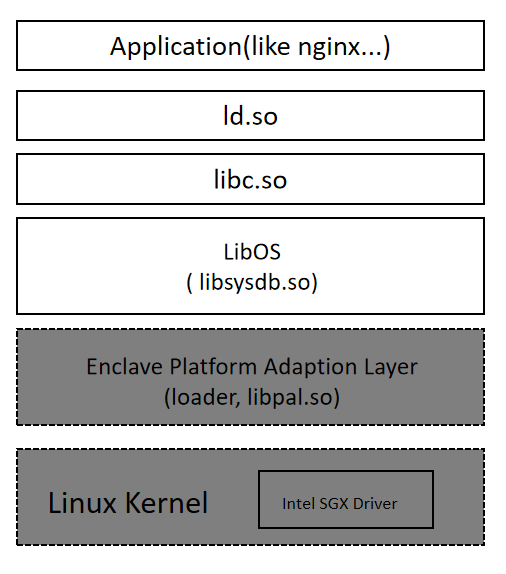

# Gramine SGX 源码解析

Gramine SGX项目原名为Graphene SGX, 是支持SGX Enclave的著名LibOS项目之一。LibOS 类似 Unikernel，可以让程序无需改动直接运行在LibOS中，相对于虚拟机又更轻量级。

Gramine SGX架构如下图所示：

## 项目的核心模块
- PAL层
   
   包括运行于Linux层的loader程序，和运行于SGX Enclave的libpal.so
- LibOS

    对应的库为libsysdb.so, 主要功能为提供操作系统syscall模拟接口

- 基础库 如libc.so ls.so等
   
   方便应用程序可以无迁移形式运行在Gramine中

## Gramine SGX 使用教程

## 源码解析

源码解析分为以下几个章节

 - Linux系统如何启动一个新进程
 - loader如何载入 libpal.so 到 Enclave
 - libpal.so 如何载入libOS(libsysdb.so)
 - libOS 启动应用程序
 - 应用程序syscall工作原理
 - 如何启动一个新线程
 - 中断处理