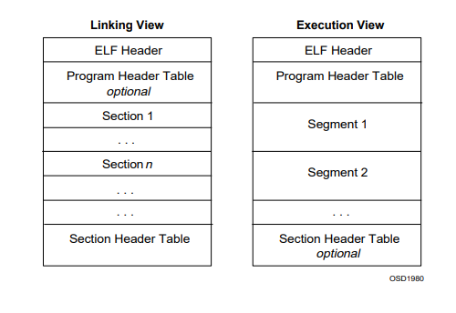

# ELF启动过程详解

## ELF文件结构

ELF全称为Executable and Linkable Format, 详细结构可参考[ELF File Format](https://refspecs.linuxfoundation.org/elf/elf.pdf)。

ELF有三种目标文件
- relocatable file 可重定位文件
- executable file 可执行文件
- shared object file, 动态库文件

ELF结构如下图所示



详细结构请参考文档，本文列出需要注意的一些ELF Header, Program Header 以及Section Header。

ELF Header 
- e_entry Entry point address, 表示程序的启动入口函数地址
  

Program Header

- p_type program header 类型，可选值有PT_NULL，PT_LOAD,等等，此处我们注意   pt_type 为PT_INTERP和PT_DYNAMIC


Program Interperter

如果ELF文件链接了其他动态库，则会包含一个PT_INTERP Program Header。系统通过PT_INTERP 头读取到Interperter的路径，再使用Interperter去启动ELF程序。Interperter会检查ELF的动态链接是否满足，详细信息请参考[ELF File Format](https://refspecs.linuxfoundation.org/elf/elf.pdf)。

readelf可以读取ELF文件详细信息。例如作者helloworld文件，第一个直接以gcc -o 编译，链接libc动态库，readelf -a helloworld 结果如下(省略了部分内容):

```
ELF Header:
  Magic:   7f 45 4c 46 02 01 01 00 00 00 00 00 00 00 00 00
  Class:                             ELF64
  Data:                              2's complement, little endian
  Version:                           1 (current)
  OS/ABI:                            UNIX - System V
  ABI Version:                       0
  Type:                              DYN (Shared object file)
  Machine:                           Advanced Micro Devices X86-64
  Version:                           0x1
  Entry point address:               0x1060
  Start of program headers:          64 (bytes into file)
  Start of section headers:          14712 (bytes into file)
  Flags:                             0x0
  Size of this header:               64 (bytes)
  Size of program headers:           56 (bytes)
  Number of program headers:         13
  Size of section headers:           64 (bytes)
  Number of section headers:         31
  Section header string table index: 30

Section Headers:
  [Nr] Name              Type             Address           Offset
       Size              EntSize          Flags  Link  Info  Align
  [ 0]                   NULL             0000000000000000  00000000
       0000000000000000  0000000000000000           0     0     0
  [ 1] .interp           PROGBITS         0000000000000318  00000318
       000000000000001c  0000000000000000   A       0     0     1
  ...

Program Headers:
  Type           Offset             VirtAddr           PhysAddr
                 FileSiz            MemSiz              Flags  Align
  PHDR           0x0000000000000040 0x0000000000000040 0x0000000000000040
                 0x00000000000002d8 0x00000000000002d8  R      0x8
  INTERP         0x0000000000000318 0x0000000000000318 0x0000000000000318
                 0x000000000000001c 0x000000000000001c  R      0x1
      [Requesting program interpreter: /lib64/ld-linux-x86-64.so.2]
  LOAD           0x0000000000000000 0x0000000000000000 0x0000000000000000
                 0x00000000000005f8 0x00000000000005f8  R      0x1000
  LOAD           0x0000000000001000 0x0000000000001000 0x0000000000001000
                 0x00000000000001f5 0x00000000000001f5  R E    0x1000
  LOAD           0x0000000000002000 0x0000000000002000 0x0000000000002000

Symbol table '.symtab' contains 65 entries:
   Num:    Value          Size Type    Bind   Vis      Ndx Name
   ...
    59: 0000000000001060    47 FUNC    GLOBAL DEFAULT   16 _start
    60: 0000000000004010     0 NOTYPE  GLOBAL DEFAULT   26 __bss_start
    61: 0000000000001149    38 FUNC    GLOBAL DEFAULT   16 main
    62: 0000000000004010     0 OBJECT  GLOBAL HIDDEN    25 __TMC_END__
    63: 0000000000000000     0 NOTYPE  WEAK   DEFAULT  UND _ITM_registerTMCloneTable
    64: 0000000000000000     0 FUNC    WEAK   DEFAULT  UND __cxa_finalize@@GLIBC_2.2
...

```

从上可以看出，程序Entry point address为0x1060，代表的函数为 _start, 也就是程序入口函数。程序的Interperter为/lib64/ld-linux-x86-64.so.2。

对比使用musl-libc 静态链接libc的同一个程序，编译方法可以参考[Using musl libc](https://www.musl-libc.org/how.html)。readelf结果为:

```
ELF Header:
  Magic:   7f 45 4c 46 02 01 01 00 00 00 00 00 00 00 00 00
  Class:                             ELF64
  Data:                              2's complement, little endian
  Version:                           1 (current)
  OS/ABI:                            UNIX - System V
  ABI Version:                       0
  Type:                              EXEC (Executable file)
  Machine:                           Advanced Micro Devices X86-64
  Version:                           0x1
  Entry point address:               0x40104d
  Start of program headers:          64 (bytes into file)
  Start of section headers:          17720 (bytes into file)
  Flags:                             0x0
  Size of this header:               64 (bytes)
  Size of program headers:           56 (bytes)
  Number of program headers:         6
  Size of section headers:           64 (bytes)
  Number of section headers:         17
  Section header string table index: 16

Section Headers:
  [Nr] Name              Type             Address           Offset
       Size              EntSize          Flags  Link  Info  Align
  [ 0]                   NULL             0000000000000000  00000000
       0000000000000000  0000000000000000           0     0     0
  [ 1] .init             PROGBITS         0000000000401000  00001000
       0000000000000003  0000000000000000  AX       0     0     1
  ...
Program Headers:
  Type           Offset             VirtAddr           PhysAddr
                 FileSiz            MemSiz              Flags  Align
  LOAD           0x0000000000000000 0x0000000000400000 0x0000000000400000
                 0x0000000000000190 0x0000000000000190  R      0x1000
  LOAD           0x0000000000001000 0x0000000000401000 0x0000000000401000
                 0x0000000000000e42 0x0000000000000e42  R E    0x1000
  ...

Symbol table '.symtab' contains 145 entries:
   Num:    Value          Size Type    Bind   Vis      Ndx Name
   ...
   112: 000000000040104d     0 NOTYPE  GLOBAL DEFAULT    2 _start
   113: 0000000000401063    40 FUNC    GLOBAL DEFAULT    2 _start_c
   114: 0000000000404040   232 OBJECT  GLOBAL HIDDEN    11 __stdout_FILE
   115: 0000000000404150     8 OBJECT  WEAK   DEFAULT   12 program_invocation_short_
   ...
```
从上可以看出，程序Entry point address为0x40104d，代表的函数为 _start, 也就是程序入口函数。程序的没有PT_INTERP Program Header。

## Bash

bash 执行 elf文件流程代码如下所示：
```
/* Execute a simple command that is hopefully defined in a disk file
   somewhere.

   1) fork ()
   2) connect pipes
   3) look up the command
   4) do redirections
   5) execve ()
   6) If the execve failed, see if the file has executable mode set.
   If so, and it isn't a directory, then execute its contents as
   a shell script.

   Note that the filename hashing stuff has to take place up here,
   in the parent.  This is probably why the Bourne style shells
   don't handle it, since that would require them to go through
   this gnarly hair, for no good reason.

   NOTE: callers expect this to fork or exit(). */

/* Name of a shell function to call when a command name is not found. */
#ifndef NOTFOUND_HOOK
#  define NOTFOUND_HOOK "command_not_found_handle"
#endif

static int
execute_disk_command (words, redirects, command_line, pipe_in, pipe_out,
		      async, fds_to_close, cmdflags)
     WORD_LIST *words;
     REDIRECT *redirects;
     char *command_line;
     int pipe_in, pipe_out, async;
     struct fd_bitmap *fds_to_close;
     int cmdflags;
```

从注释上可以看到，最终执行一个elf进程会调用 execve, 而检查libc（以musl libc为例）， 代码如下:
```
int execve(const char *path, char *const argv[], char *const envp[])
{
	/* do we need to use environ if envp is null? */
	return syscall(SYS_execve, path, argv, envp);
}
```

libc通过调用syscall SYS_execve来启动进程。

## Linux Kernel SYS_execve syscall实现

详情可以参考文档[How Does Linux Kernel run a program](https://0xax.gitbooks.io/linux-insides/content/SysCall/linux-syscall-4.html)。

以linux kernel 4.16代码为例， execve对应的实现位置为fs/exec.c SYSCALL_DEFINE3(execve, ...)， 参考如下:
```
SYSCALL_DEFINE3(execve,
		const char __user *, filename,
		const char __user *const __user *, argv,
		const char __user *const __user *, envp)
{
	return do_execve(getname(filename), argv, envp);
}

```

执行可执行文件的调用流程为do_execve->do_execveat_common->exec_binprm->search_binary_handler

search_binary_handler 内部通过查找已经注册的handler来处理对应的二进制文件，例如elf对应的注册文件为fs/binfmt_elf.c

```
...
static struct linux_binfmt elf_format = {
	.module		= THIS_MODULE,
	.load_binary	= load_elf_binary,
	.load_shlib	= load_elf_library,
	.core_dump	= elf_core_dump,
	.min_coredump	= ELF_EXEC_PAGESIZE,
};

...

static int __init init_elf_binfmt(void)
{
	register_binfmt(&elf_format);
	return 0;
}

static void __exit exit_elf_binfmt(void)
{
	/* Remove the COFF and ELF loaders. */
	unregister_binfmt(&elf_format);
}

core_initcall(init_elf_binfmt);
module_exit(exit_elf_binfmt);
MODULE_LICENSE("GPL");
```

elf_format 对应的load elf 函数为load_elf_binary, 代码如下:
```
static int load_elf_binary(struct linux_binprm *bprm)
{
	...
   if (elf_interpreter) {
		unsigned long interp_map_addr = 0;

		elf_entry = load_elf_interp(&loc->interp_elf_ex,
					    interpreter,
					    &interp_map_addr,
					    load_bias, interp_elf_phdata);
		if (!IS_ERR((void *)elf_entry)) {
			/*
			 * load_elf_interp() returns relocation
			 * adjustment
			 */
			interp_load_addr = elf_entry;
			elf_entry += loc->interp_elf_ex.e_entry;
		}
		if (BAD_ADDR(elf_entry)) {
			retval = IS_ERR((void *)elf_entry) ?
					(int)elf_entry : -EINVAL;
			goto out_free_dentry;
		}
		reloc_func_desc = interp_load_addr;

		allow_write_access(interpreter);
		fput(interpreter);
		kfree(elf_interpreter);
	} else {
		elf_entry = loc->elf_ex.e_entry;
		if (BAD_ADDR(elf_entry)) {
			retval = -EINVAL;
			goto out_free_dentry;
		}
	}
   ...
   
   start_thread(regs, elf_entry, bprm->p);
	retval = 0;
   ...
}
```

从代码可以看出，ELF文件解析会判断ELF文件是否有interpreter Program Header。 如果有该Header，则会load interpreter de elf_entry； 若没有，则读取的是该ELF文件的elf_entry。 读取elf_entry后，调用start_thread 启动elf进程。


start_thread 在不同的硬件平台采用不同的实现，例如arm平台实现位置为arch/arm/include/asm/processor.h：
```
#define start_thread(regs,pc,sp)					\
({									\
	unsigned long r7, r8, r9;					\
									\
	if (IS_ENABLED(CONFIG_BINFMT_ELF_FDPIC)) {			\
		r7 = regs->ARM_r7;					\
		r8 = regs->ARM_r8;					\
		r9 = regs->ARM_r9;					\
	}								\
	memset(regs->uregs, 0, sizeof(regs->uregs));			\
	if (IS_ENABLED(CONFIG_BINFMT_ELF_FDPIC) &&			\
	    current->personality & FDPIC_FUNCPTRS) {			\
		regs->ARM_r7 = r7;					\
		regs->ARM_r8 = r8;					\
		regs->ARM_r9 = r9;					\
		regs->ARM_r10 = current->mm->start_data;		\
	} else if (!IS_ENABLED(CONFIG_MMU))				\
		regs->ARM_r10 = current->mm->start_data;		\
	if (current->personality & ADDR_LIMIT_32BIT)			\
		regs->ARM_cpsr = USR_MODE;				\
	else								\
		regs->ARM_cpsr = USR26_MODE;				\
	if (elf_hwcap & HWCAP_THUMB && pc & 1)				\
		regs->ARM_cpsr |= PSR_T_BIT;				\
	regs->ARM_cpsr |= PSR_ENDSTATE;					\
	regs->ARM_pc = pc & ~1;		/* pc */			\
	regs->ARM_sp = sp;		/* sp */			\
})
```

如上所示，arm平台start_thread 先将特权级别设置为USR_MODE, 再将pc寄存器地址设置为elf_entry地址，以及设置sp地址。
