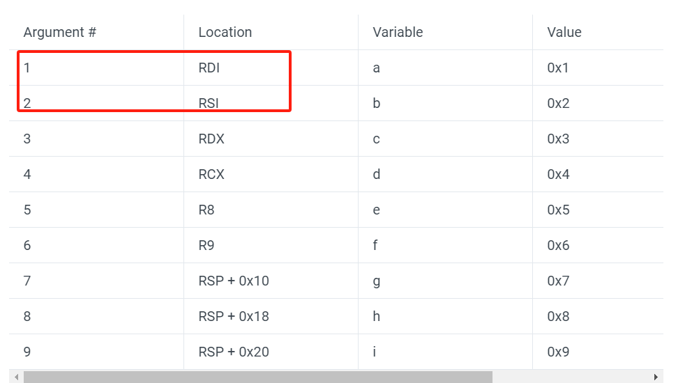
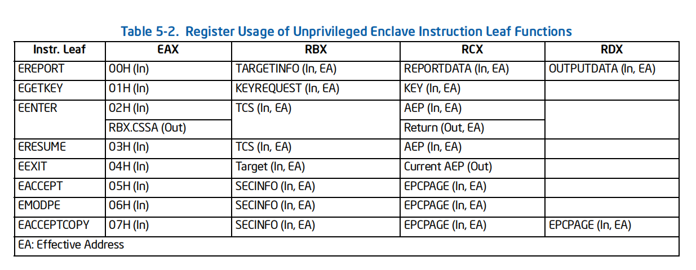
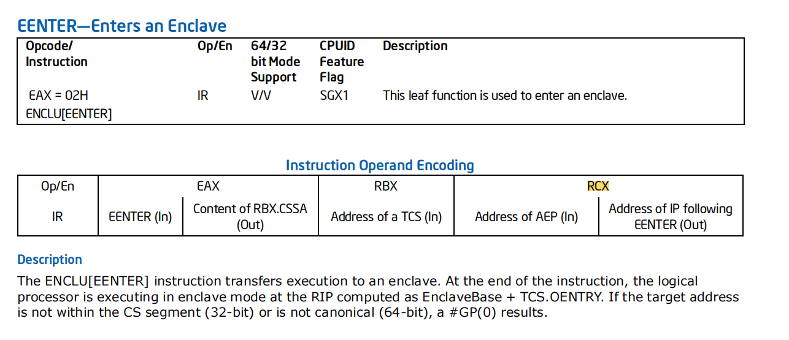
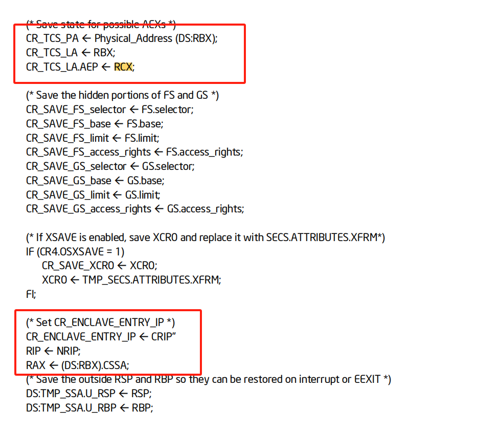
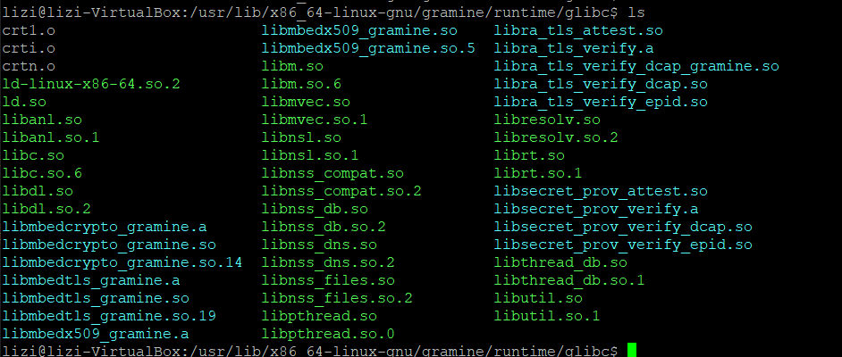
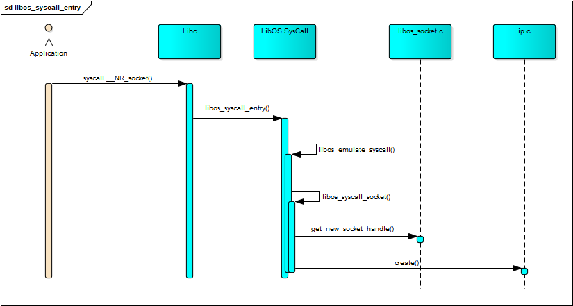
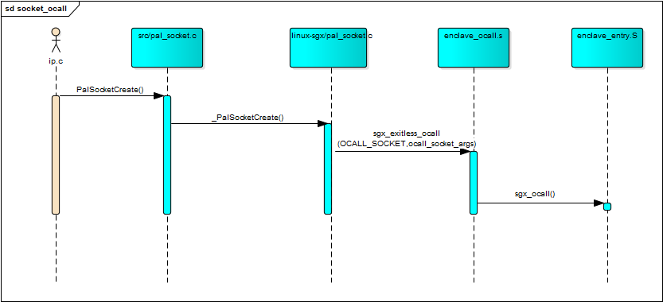
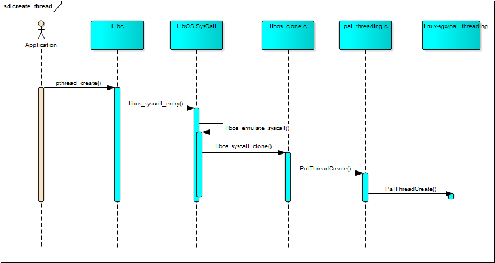

# loader详解

## gramine-sgx 使用简介

gramine-sgx命令为
```
gramine-sgx  application  args
```

gramine-sgx 脚本源码如下 (省略部分细节)
```
PAL_CMD="/usr/lib/x86_64-linux-gnu/gramine/sgx/loader"
LIBPAL_PATH="/usr/lib/x86_64-linux-gnu/gramine/sgx/libpal.so"
HOST_PAL_PATH="/usr/lib/x86_64-linux-gnu/gramine/sgx"
SGX=1

APPLICATION=
ENVS=()
PREFIX=()

...

while [ "$1" != "" ];
do
    if [ "$APPLICATION" == "" ]; then
        APPLICATION=$1
        shift
        continue
    fi

    break
done

if [ "$APPLICATION" == "" ]; then
    echo "Usage: $0 [<application>] <args>..."
    exit 2
fi

if [ "$SGX" == "1" ] && [ ! -e "$APPLICATION.manifest.sgx" ]; then
    echo "Invalid application path specified ($APPLICATION.manifest.sgx does not exist)." >&2
    echo "The path should point to application configuration files, so that they can be" >&2
    echo "found after appending corresponding extensions." >&2
    exit 2
fi
...

if [ "$SGX" == "1" ] \
&& [ "upstream" = oot ] \
&& [ ! -e "$APPLICATION".token ] \
&& [ -f "$APPLICATION".sig ] \
&& [ -z "$GRAMINE_NO_AUTO_GET_TOKEN" ]
then
    "/usr"/"bin"/gramine-sgx-get-token \
        --output "$APPLICATION".token \
        --sig "$APPLICATION".sig \
    >&2
fi


CMD=("${ENVS[@]}")
CMD+=("${PREFIX[@]}")
CMD+=("$PAL_CMD" "$LIBPAL_PATH" init "$APPLICATION" "$@")
exec env "${CMD[@]}"

```

从上脚本可以看出，脚本实际执行的命令为loader libpal.so init {application} {args}, 同时会检查{application}.manifest.sgx配置文件以及检查签名文件。


manifest.sgx 配置文件内容

参考gramine示例模板, 详细说明请阅读[gramine配置文件文档](https://gramine.readthedocs.io/en/stable/manifest-syntax.html#)
```
loader.entrypoint = "file:{{ gramine.libos }}"
libos.entrypoint = "{{ install_dir }}/sbin/nginx"

loader.log_level = "{{ log_level }}"

loader.env.LD_LIBRARY_PATH = "/lib:{{ arch_libdir }}:/usr/{{ arch_libdir }}"

loader.argv_src_file = "file:nginx_args"

loader.uid = 1000
loader.gid = 1000

sys.enable_sigterm_injection = true

fs.mounts = [
]

sgx.debug = true
sgx.edmm_enable = {{ 'true' if env.get('EDMM', '0') == '1' else 'false' }}
sgx.enclave_size = "512M"
sgx.max_threads = 4

sgx.trusted_files = [
]

sgx.allowed_files = [
  "file:{{ install_dir }}/logs",
]

```

- loader.entrypoint 指定的是libos的路径，目前只有一个libos, 也就是libsysdb.so
- libos.entrypoint 该配置文件在sgx enclave执行的第一个用户可执行文件。


loader是gramine整个系统在linux非安全区的入口程序，loader对应的源码文件可以参考gramine/pal/src/host/linux-sgx/meson.build

```
libpal_sgx_host = executable('loader',
    'common_manifest_sgx_parser.c',
    'host_ecalls.c',
    'host_entry.S',
    'host_exception.c',
    'host_framework.c',
    'host_log.c',
    'host_main.c',
    'host_ocalls.c',
    'host_perf_data.c',
    'host_platform.c',
    'host_process.c',
    'host_profile.c',
    'host_syscall.c',
    'host_thread.c',
    pal_linux_common_sources_host,
    ...
)
```
pal_linux_common_sources_host 对应的源码文件参考gramine/pal/src/host/linux-common/meson.build
```
pal_linux_common_sources_host = files(
    'debug_map.c',
    'etc_host_info.c',
    'file_utils.c',
    'main_exec_path.c',
    'proc_maps.c',
    'reserved_ranges.c',
    'timespec_utils.c',
    'topo_info.c',
)
```

loader程序入口为 gramine/pal/src/host/linux-sgx/host_main.c文件中 int main(int argc, char* argv[], char*envp[]) 函数。loader中有几个重要的全局变量。

```
char* g_pal_loader_path = NULL;  // loader文件的full path
char* g_libpal_path = NULL;      // libpal.so 文件全路径
pid_t g_host_pid;                // host中pid

struct pal_enclave {
    /* attributes */
    bool is_first_process; // Initial process in Gramine instance is special.

    char* application_path;   //sgx运行的用户进程路径
    char* raw_manifest_data;
    unsigned long baseaddr;
    unsigned long size;
    unsigned long thread_num;
    unsigned long rpc_thread_num;
    unsigned long ssa_frame_size;
    bool edmm_enabled;
    enum sgx_attestation_type attestation_type;
    char* libpal_uri; /* Path to the PAL binary */

#ifdef DEBUG
    /* profiling */
    bool profile_enable;
    int profile_mode;
    char profile_filename[64];
    bool profile_with_stack;
    int profile_frequency;
#endif
};

struct pal_enclave g_pal_enclave;  //enclave进程配置信息
```

main函数的主要流程包括（本文先讲第二个参数为init情形）

  - 读取loader全路径
  - 复制libpal.so路径 
  - 检查{application}.manifest.sgx 文件，并读取文件
  - 截取application args参数
  - 调用load_enclave函数


load_enclave 核心流程如下代码

```
    ...
    ret = parse_loader_config(enclave->raw_manifest_data, enclave, &extra_runtime_domain_names_conf);
    ...

    enclave->libpal_uri = alloc_concat(URI_PREFIX_FILE, URI_PREFIX_FILE_LEN, g_libpal_path, -1);
    
    ...
    ret = initialize_enclave(enclave, enclave->raw_manifest_data);
    if (ret < 0)
        return ret;

    ret = sgx_signal_setup();
    if (ret < 0)
        return ret;

    
    ...
    pal_host_tcb_init(tcb, /*stack=*/NULL,
                      alt_stack); /* main thread uses the stack provided by Linux */
    ret = pal_thread_init(tcb);
    
    ....

    /* start running trusted PAL */
    ecall_enclave_start(enclave->libpal_uri, args, args_size, env, env_size, parent_stream_fd,
                        &qe_targetinfo, &topo_info, &dns_conf, enclave->edmm_enabled,
                        reserved_mem_ranges, reserved_mem_ranges_size);

   
```

initialize_enclave 以及介绍如下
```
    
    //读取libpal.so
    enclave_image = DO_SYSCALL(open, enclave->libpal_uri + URI_PREFIX_FILE_LEN,
                               O_RDONLY | O_CLOEXEC, 0);
    
    // 检查application 签名
    sig_path = alloc_concat(g_pal_enclave.application_path, -1, ".sig", -1);
    
    ...

    // 调用驱动接口创建enclave
    memset(&enclave_secs, 0, sizeof(enclave_secs));
    enclave_secs.base = enclave->baseaddr;
    enclave_secs.size = enclave->size;
    ret = create_enclave(&enclave_secs, &enclave_token);
    

    // 创建Enclave对应的内存区域

    /* SECS contains SSA frame size in pages, convert to size in bytes */
    enclave->ssa_frame_size = enclave_secs.ssa_frame_size * g_page_size;

    /* Start populating enclave memory */
    struct mem_area {
        const char* desc;
        bool skip_eextend;

        enum {
            ELF_FD, // read from `fd` and parse as ELF
            ZERO,
            BUF,
            TCS,
            TLS
        } data_src;
        union {
            int fd; // valid iff data_src == ELF_FD
            struct { // valid iff data_src == BUF
                const char* buf;
                size_t buf_size;
            };
        };

        unsigned long addr, size, prot;
        enum sgx_page_type type;
    };

    ...

    areas[area_num] = (struct mem_area){.desc         = "pal",
                                        .skip_eextend = false,
                                        .data_src     = ELF_FD,
                                        .fd           = enclave_image,
                                        /* `addr` and `size` are set below */
                                        .prot         = 0,
                                        .type         = SGX_PAGE_TYPE_REG};
    struct mem_area* pal_area = &areas[area_num++];
    
    //解析libpal.so ELF头信息，读取libpao.so entry_addr, 并根据mem area地址重新计算偏移

    ret = scan_enclave_binary(enclave_image, &pal_area->addr, &pal_area->size, &enclave_entry_addr);
    ...
    uintptr_t last_populated_addr = enclave->baseaddr + enclave->size;
    for (int i = 0; i < area_num; i++) {
        if (areas[i].addr)
            continue;
        areas[i].addr = last_populated_addr - areas[i].size;
        last_populated_addr = areas[i].addr;
    }

    enclave_entry_addr += pal_area->addr;

    ...
    //读取libpal.so 到 enclave中
    log_debug("Adding pages to SGX enclave, this may take some time...");
    for (int i = 0; i < area_num; i++) {
        if (areas[i].data_src == ELF_FD) {
            ret = load_enclave_binary(&enclave_secs, areas[i].fd, areas[i].addr, areas[i].prot);
            ...
            continue;
        }

        ...

        void* data = NULL;
        if (areas[i].data_src != ZERO) {
            data = (void*)DO_SYSCALL(mmap, NULL, areas[i].size, PROT_READ | PROT_WRITE,
                                     MAP_ANONYMOUS | MAP_PRIVATE, -1, 0);
            ...
        }

        if (areas[i].data_src == TLS) {
            ...
        } else if (areas[i].data_src == TCS) {
            for (uint32_t t = 0; t < enclave->thread_num; t++) {
                sgx_arch_tcs_t* tcs = data + g_page_size * t;
                ...
                // 设置每个tcs的oentry为 libpal entry
                tcs->oentry    = enclave_entry_addr - enclave->baseaddr;
                ...
            }
        } else if (areas[i].data_src == BUF) {
            memcpy(data, areas[i].buf, areas[i].buf_size);
        } else {
            assert(areas[i].data_src == ZERO);
        }

        ret = add_pages_to_enclave(&enclave_secs, (void*)areas[i].addr, data, areas[i].size,
                                   areas[i].type, areas[i].prot, areas[i].skip_eextend,
                                   areas[i].desc);

       
    }
    ...
    // 初始化Enclave
    ret = init_enclave(&enclave_secs, &enclave_sigstruct, &enclave_token);
    ...
```
initialize_enclave 中 enclave 内存区域配置详情见Enclave 相关数据结构详解。

initialize_enclave之后， 调用pal_host_tcb_init初始化每个enclave线程的TCB信息。TCB结构信息如下所示

```
// pal_tcb.h
/* private to untrusted Linux PAL, unique to each untrusted thread */
typedef struct pal_host_tcb {
    struct pal_host_tcb* self;
    sgx_arch_tcs_t* tcs;           /* TCS page of SGX corresponding to thread, for EENTER */
    void* stack;                   /* bottom of stack, for later freeing when thread exits */
    void* alt_stack;               /* bottom of alt stack, for child thread to init alt stack */
    uint8_t is_in_aex_profiling;   /* non-zero if thread is currently doing AEX profiling */
    atomic_ulong eenter_cnt;       /* # of EENTERs, corresponds to # of ECALLs */
    atomic_ulong eexit_cnt;        /* # of EEXITs, corresponds to # of OCALLs */
    atomic_ulong aex_cnt;          /* # of AEXs, corresponds to # of interrupts/signals */
    atomic_ulong sync_signal_cnt;  /* # of sync signals, corresponds to # of SIGSEGV/SIGILL/.. */
    atomic_ulong async_signal_cnt; /* # of async signals, corresponds to # of SIGINT/SIGCONT/.. */
    uint64_t profile_sample_time;  /* last time sgx_profile_sample() recorded a sample */
    int32_t last_async_event;      /* last async signal, reported to the enclave on ocall return */
} PAL_HOST_TCB;

```
接着再调用pal_thread_init将主线程的TCB信息绑定到GS寄存器。如下所示:
```
int pal_thread_init(void* tcbptr) {
    PAL_HOST_TCB* tcb = tcbptr;
    int ret;

    /* set GS reg of this thread to thread's TCB; after this point, can use pal_get_host_tcb() */
    ret = DO_SYSCALL(arch_prctl, ARCH_SET_GS, tcb);
    ...
}
```

load_enclave 调用ecall_enclave_start 进入libpal.so entry


## loader进入enclave流程

在函数调用ecall_enclave_start中，进入sgx enclave的代码为
```
struct ecall_enclave_start start_args = {
        .libpal_uri               = libpal_uri,
        .libpal_uri_len           = strlen(libpal_uri),
        .args                     = args,
        .args_size                = args_size,
        .env                      = env,
        .env_size                 = env_size,
        .parent_stream_fd         = parent_stream_fd,
        .qe_targetinfo            = qe_targetinfo,
        .topo_info                = topo_info,
        .dns_host_conf            = dns_conf,
        .edmm_enabled             = edmm_enabled,
        .reserved_mem_ranges      = reserved_mem_ranges,
        .reserved_mem_ranges_size = reserved_mem_ranges_size,
        .rpc_queue                = g_rpc_queue,
    };
    return sgx_ecall(ECALL_ENCLAVE_START, &start_args);
```

参考[X64 calling conventions](https://www.ired.team/miscellaneous-reversing-forensics/windows-kernel-internals/linux-x64-calling-convention-stack-frame), 函数调用对应的寄存器参考下图：

sgx_ecall 调用的寄存器RDI为ECALL_ENCLAVE_START, RSI为start_args指针。

sgx_ecall(ECALL_ENCLAVE_START) 来进入Enclave。 代码详见pal/src/host/linux-sgx/host_entry.S

代码开始，sgx_ecall将sgx_entry地址保存到rdx寄存器, sgx_entry作用详见后续解释。
```
sgx_ecall:
    .cfi_startproc

    # put entry address in RDX
    leaq .Lsgx_entry(%rip), %rdx

    # other arguments: RDI - code, RSI - ms
```

随后，sgx_ecall保存callee_save寄存器
```
.Ldo_ecall_callee_save:
    pushq %rbx
    .cfi_adjust_cfa_offset 8
    ...
    pushq %r15
    .cfi_adjust_cfa_offset 8
```

接着，sgx_ecall调用do_ecall进入enclave
```
.Ldo_ecall:
    # increment per-thread EENTER counter for stats
    lock incq %gs:PAL_HOST_TCB_EENTER_CNT

    # RBX has to be the TCS of the thread
    movq %gs:PAL_HOST_TCB_TCS, %rbx

    # RCX has to be the AEP (Asynchronous Exit Pointer)
    leaq async_exit_pointer(%rip), %rcx

    movq $EENTER, %rax
    enclu
```

如上所示，GS寄存器绑定的是线程对应的TCB信息，do_ecall 先将eenter_cnt自增（PAL_HOST_TCB_EENTER_CNT定义eenter_cnt的偏移量，其他几个定义类似）。再将TCB中tcs地址设置到rbx寄存器，最后将async_exit_pointer设置到rcx寄存器，最后调用EENTER进入Enclave。enclu后，系统切换到enclave中执行。

进入退出Enclave流程详见[Intel Software Guard Extension Programming Reference](https://www.intel.com/content/dam/develop/external/us/en/documents/329298-002-629101.pdf) 3.2章节。使用EENTER进入Enclave, EEXIT退出Enclave，同时
EENTER定义了AEP（Asynchronous Exit Pointer）参数。 AEX(Asynchronous Encalve Exit)是指Enclave在执行的过程中被同步或者异步事件打断，例如发生异常，中断等等，从而导致处理器安全保存Encalve状态并且退出Enclave。而AEP地址是异常处理结束调用IRET返回时处理的地址，用于在AEP中返回Enclave执行.

ENCLU寄存使用说明详见上述文档5.1.2节，如下图所示。


EENTER Enclave时，EAX值为2（也就是sgx_arch.h中EENTER宏定义值）, RBX为TCS指针（也即上述gs:PAL_HOST_TCB_TCS），RCX为AEP值。同时RDI和RSI保持sgx_ecall传入的参数不变，即RDI为ECALL_ENCLAVE_START, RSI为start_args指针。进入enclave后流程详见后续介绍。

由于encalve内部无法调用system call, 所以在调用system call时需要先退出enclave，再在host系统模拟相关操作，例如调用system call, 而sgx_entry即为退出enclave时在host系统的入口（用于enclave模拟syscall），详细见后续单独章节介绍。

```
    # currently only ECALL_THREAD_RESET returns
.Lafter_resume:
    ...

    .global async_exit_pointer
    .type async_exit_pointer, @function

async_exit_pointer:
    .cfi_startproc
    .cfi_undefined %rip

    # increment per-thread AEX counter for stats
    lock incq %gs:PAL_HOST_TCB_AEX_CNT

#ifdef DEBUG
    ...
#endif

    .cfi_endproc

    # fall-through to ERESUME

    .global eresume_pointer
    .type eresume_pointer, @function

eresume_pointer:
    enclu   # perform ERESUME

    .global async_exit_pointer_end
    .type async_exit_pointer_end, @function

async_exit_pointer_end:

    .global sgx_raise
    .type sgx_raise, @function

sgx_raise:
    leaq .Lafter_resume(%rip), %rdx
    jmp .Ldo_ecall_callee_save

.Lsgx_entry:
    # arguments: RDI - code, RSI - ms
    .cfi_startproc

    # increment per-thread EEXIT counter for stats
    lock incq %gs:PAL_HOST_TCB_EEXIT_CNT

    leaq ocall_table(%rip), %rbx
    movq (%rbx,%rdi,8), %rbx
    movq %rsi, %rdi

    pushq %rbp
    .cfi_adjust_cfa_offset 8
    movq %rsp, %rbp
    .cfi_offset %rbp, -16
    .cfi_def_cfa_register %rbp

#if DEBUG
    ...
#else
    andq $~0xF, %rsp  # Required by System V AMD64 ABI.
#endif

    callq *%rbx

    movq %rbp, %rsp
    popq %rbp
    .cfi_def_cfa %rsp, 8

    movq %rax, %rdi
    movq $PAL_EVENT_NO_EVENT, %rsi
    lock xchgl %esi, %gs:PAL_HOST_TCB_LAST_ASYNC_EVENT

    # return to enclave, arguments:
    # RDI - return value
    # RSI - external event
    jmp .Ldo_ecall
    .cfi_endproc
```

进入enclave后，会从哪个地址开始执行，从libpal.so 源码开始分析。

从pal/src/host/linux-sgx/meson.build文件可以看到
```
pal_sgx_lds = meson.current_source_dir() / 'enclave.lds'

libpal_sgx = shared_library('pal',
    'common_manifest_sgx_parser.c',
    ...

    link_args: [
        '-nostdlib',

        # For PAL symbol resolution, we use old-style hash (DT_HASH) table instead of the default
        # GNU hash (DT_GNU_HASH) table -- to figure out the number of dynamic symbols in the SYMTAB
        # symbol table
        '-Wl,--hash-style=sysv',

        # PAL is expected to be linked with RELRO (Relocation Read-Only)
        '-Wl,-zrelro',
        '-Wl,-znow',

        '-Wl,-zcombreloc',
        '-Wl,-zdefs',
        '-Wl,--version-script=@0@'.format(pal_sgx_map.full_path()),
        '-Wl,-T@0@'.format(pal_sgx_lds),
        '-Wl,--eh-frame-hdr',
    ],

    link_depends: [
        pal_sgx_map,
        pal_sgx_lds,
    ],

    dependencies: [
        common_dep,
        cryptoadapter_dep,
        ioctls_dep,
    ],

    install: true,
    install_dir: pkglibdir / 'sgx',
)
```

libpal.so对应的linker scripts文件为meson.build同目录下的enclave.lds。
```
OUTPUT_FORMAT("elf64-x86-64", "elf64-x86-64", "elf64-x86-64")
OUTPUT_ARCH(i386:x86-64)
ENTRY(enclave_entry)

SECTIONS
{
  ...
```
可以看到入口函数为enclave_entry, 函数定义在pal/src/host/linux-sgx/enclave_entry.S 中。

```
    .global enclave_entry
    .type enclave_entry, @function
enclave_entry:
    .cfi_startproc

    # PAL convention on EENTER:
    #   RAX - current SSA index (aka CSSA), can be 0 (`cssa0_`) or 1 (`cssa1_`)
    #   RBX - address of TCS
    #   RCX - address of IP following EENTER
    #   [ other regs are not trusted ]
    #
    # The following code is hardened to defend attacks from untrusted host. Any states given by the
    # host instead of the ISA must be assumed potentially malicious.
    #
    # This thread can be interrupted but then the below check branches to .Lcssa1_exception (because
    # on interrupt, CSSA = 1). So the outside can't re-enter the checks below in the middle.

    # x86-64 SysV ABI requires RFLAGS.DF = 0 on entry to function call.
    cld

    # CSSA = 1 -- this is a "stage-1 exception handler" flow
    cmpq $0, %rax
    jne .Lcssa1_exception

    # RCX contains ECALL return address (filled by EENTER hardware flow)
    movq %rcx, %gs:SGX_ECALL_RETURN_ADDR

    # OCALL stack was prepared previously -- this is a "return from OCALL" flow
    cmpq $0, %gs:SGX_PRE_OCALL_STACK
    jne .Lcssa0_ocall_return

    # CSSA = 0 and it's not an OCALL -- this is an "ECALL" flow
    jmp .Lcssa0_ecall

.Lcssa0_ecall:
    # PAL convention:
    #   RDI - ECALL number
    #   RSI - pointer to ecall arguments
    #   RDX - exit target
    #   RCX - enclave base

    cmpq $ECALL_THREAD_RESET, %rdi
    je .Lcssa0_ecall_thread_reset

    # Except ECALL_THREAD_RESET, ecalls are only used to start a thread (main or additional
    # threads). We already checked for case of ECALL_THREAD_RESET, so at this point we should only
    # get exactly one ecall per thread.
    cmpq $0, %gs:SGX_THREAD_STARTED
    je .Lcssa0_ecall_enclave_or_thread_start
    FAIL_LOOP

.Lcssa0_ecall_enclave_or_thread_start:
    movq $1, %gs:SGX_THREAD_STARTED

    # calculate enclave base = RBX (trusted) - GS:SGX_TCS_OFFSET
    mov %rbx, %rcx
    subq %gs:SGX_TCS_OFFSET, %rcx

    # switch to enclave stack
    movq %gs:SGX_INITIAL_STACK_ADDR, %rsp

    # clear the rest of register states
    ...

    # register states need to be carefully checked, so we move handling to handle_ecall() in C code
    callq handle_ecall

    # handle_ecall() will only return when invalid parameters has been passed
    FAIL_LOOP
```

注意此段代码中几个寄存器的解释：
- RAX  Current SSA Index
- RBX  TCS，进入Enclave时有介绍
- RCX  address of IP following EENTER， 进入Enclave时为AEP地址

参考[SGX开发者手册](https://www.intel.com/content/dam/develop/external/us/en/documents/329298-002-629101.pdf)对应的章节，可以获取相关寄存器更详细介绍：

* 参考2.8 章节THREAD CONTROL STRUCTURE(TCS) 线程控制结构
  * OSSA （State Save Area Offset） OSSA指向状态保存区域帧的堆栈，用于在Enclave执行时发生中断或异常时保存处理器状态。
  * NSSA TCS 可用的SSA Frame数量
  * Current State Save Area Frame (CSSA) 在Enclave执行发生中断时，处理器即将用于保存状态的 SSA Frame Index。CSSA在AES时增加，在ERESUME时减少。

* 参考5.4.1 EENTER介绍，如下图所示，RCX在进入Enclave后的值为Address of IP Follwing EENTER
  
* 同参考5.4.1 EENTER最后Operation详细流程，RAX被设置成CSSA值, 如下图所示
  

enclave_entry 调用handle_ecall, handle_ecall为enclave内部处理的主入口。handle_ecall 函数声明如下:
```
void handle_ecall(long ecall_index, void* ecall_args, void* exit_target, void* enclave_base_addr);
```
参考上述calling convention, 对应的参数为:
* RDI   ecall_index
* RSI   ecall_args
* RDX   exit_target
* RCX   enclave_base_addr

参考ecall_enclave_start中参数，RDI为ECALL_ENCLAVE_START, RSI为start_args指针。参考sgx_ecall, RDX为sgx_entry地址。参考enclave_entry中实现，RBX为TCS地址，再偏移SGX_TCS_OFFSET来计算enclave base地址。


handle_ecall 后的调用顺序为 handle_ecall->pal_linux_main->pal_main, 在pal_linux_main 会在Enclave内部进行相关的检查和配置，详情请参考代码。

pal_main的核心流程为加载libos（也就是libsysdb.so）到enclave，并执行libos。 代码如下所示:
```
noreturn void pal_main(uint64_t instance_id,       /* current instance id */
                       PAL_HANDLE parent_process,  /* parent process if it's a child */
                       PAL_HANDLE first_thread,    /* first thread handle */
                       const char** arguments,     /* application arguments */
                       const char** environments   /* environment variables */) {
    ...

    ret = load_entrypoint(entrypoint_name);
    if (ret < 0)
        INIT_FAIL("Unable to load loader.entrypoint: %ld", ret);
    free(entrypoint_name);

    pal_disable_early_memory_bookkeeping();

    /* Now we will start the execution */
    start_execution(arguments, final_environments);

out_fail:
    /* We wish we will never reached here */
    INIT_FAIL("unexpected termination");
}

```

start_execution 从libsysdb.so的入口开始执行，代码如下:
```
noreturn void start_execution(const char** arguments, const char** environs) {
    ...
    assert(g_entrypoint_map.l_entry);
#ifdef __x86_64__
    __asm__ volatile("movq %1, %%rsp\n"
                     "jmp *%0\n"
                     :
                     : "r"(g_entrypoint_map.l_entry), "r"(stack_entries)
                     : "memory");
#else
#error "unsupported architecture"
#endif
    __builtin_unreachable();
}
```

libsysdb.so 对应的代码目录为libos, 对应的linker scripts文件为 libos/src/arch/x86_64/libos.lds, 从中可以看出libsysdb.so对应的入口函数为libos_start

```
OUTPUT_FORMAT("elf64-x86-64", "elf64-x86-64", "elf64-x86-64")
OUTPUT_ARCH(i386:x86-64)
ENTRY(libos_start)
```

libos_start之后的调用顺序为 libos_start->libos_init->execute_elf_object

libos_init进行了大量的操作系统初始化工作，如下所示
```
noreturn void libos_init(const char* const* argv, const char* const* envp) {
    g_pal_public_state = PalGetPalPublicState();
    assert(g_pal_public_state);

    g_log_level = g_pal_public_state->log_level;

    /* create the initial TCB, libos can not be run without a tcb */
    libos_tcb_init();

    call_init_array();

    extern const char g_gramine_commit_hash[];
    log_debug("Gramine was built from commit: %s", g_gramine_commit_hash);

    log_debug("Host: %s", g_pal_public_state->host_type);

    if (!IS_POWER_OF_2(ALLOC_ALIGNMENT)) {
        log_error("PAL allocation alignment not a power of 2");
        PalProcessExit(1);
    }

    g_manifest_root = g_pal_public_state->manifest_root;

    libos_xstate_init();

    if (!g_pal_public_state->parent_process) {
        /* No parent process - we never receive any memory. */
        g_received_user_memory = true;
    }

    RUN_INIT(init_vma);
    RUN_INIT(init_slab);
    RUN_INIT(read_environs, envp);
    RUN_INIT(init_rlimit);
    RUN_INIT(init_fs);
    RUN_INIT(init_fs_lock);
    RUN_INIT(init_dcache);
    RUN_INIT(init_handle);
    RUN_INIT(init_r_debug);

    log_debug("LibOS loaded at %p, ready to initialize", &__load_address);

    if (g_pal_public_state->parent_process) {
        struct checkpoint_hdr hdr;

        int ret = read_exact(g_pal_public_state->parent_process, &hdr, sizeof(hdr));
        if (ret < 0) {
            log_error("libos_init: failed to read the whole checkpoint header: %s",
                      unix_strerror(ret));
            PalProcessExit(1);
        }

        assert(hdr.size);
        RUN_INIT(receive_checkpoint_and_restore, &hdr);
    } else {
        g_process_ipc_ids.self_vmid = STARTING_VMID;
    }

    RUN_INIT(init_ipc);
    RUN_INIT(init_process);
    RUN_INIT(init_threading);
    RUN_INIT(init_mount_root);
    RUN_INIT(init_mount);
    RUN_INIT(init_std_handles);
    ...
```

execute_elf_object 和 linux kernel SYS_execve syscall interpreter信息，并且执行对应的interpreter程序。如下图所示，gramine实现了一版sgx环境内的libc.so，libdo.so等基础库。



interpreter即为libdl.so。interpreter会检查待启动程序的依赖是否满足，如果满足则会启动程序。至此gramine已经将原有的可执行文件在未改动的情况下迁移到sgx环境内运行。

libc对syscall的处理

libc的很多功能是通过syscall来实现的，例如打开文件，分配内存等等，而enclave内部无法直接调用syscall，所以要想程序以无迁移的形式启动，必须对libc原有的syscall进行某种处理。

参考subprojects/packagefiles/glibc-2.37/gramine-syscall.patch, 如下所示，Gramine将libc原有的syscall 替换成自定义宏GRAMINE_SYSCALL

```
...
index a524c4d7b7f96008c2d38146418449c71cbe678a..a1a3f5f0803f23474960cd1413bb59adb5acaffe 100644
--- a/sysdeps/unix/sysv/linux/x86_64/__start_context.S
+++ b/sysdeps/unix/sysv/linux/x86_64/__start_context.S
@@ -51,7 +51,7 @@ ENTRY(__push___start_context)
 	movl	$ARCH_CET_ALLOC_SHSTK, %edi
 	movl	$__NR_arch_prctl, %eax
 	/* The new shadow stack base is returned in __ssp[1].  */
-	syscall
+	GRAMINE_SYSCALL
 	testq	%rax, %rax
 	jne	L(hlt)		/* This should never happen.  */
...
```

GRAMINE_SYSCALL定义详见libos/include/arch/x86_64/gramine_entry_api.h

```
#define GRAMINE_SYSCALL_OFFSET 24

#ifdef __ASSEMBLER__

.macro GRAMINE_SYSCALL
leaq .Lafter_gramine_syscall\@(%rip), %rcx
jmpq *%gs:GRAMINE_SYSCALL_OFFSET
.Lafter_gramine_syscall\@:
.endm

#else /* !__ASSEMBLER__ */

#include <stdbool.h>
#include <stdint.h>

#define GRAMINE_STR(x)  #x
#define GRAMINE_XSTR(x) GRAMINE_STR(x)

__asm__(
    ".macro GRAMINE_SYSCALL\n"
    "leaq .Lafter_gramine_syscall\\@(%rip), %rcx\n"
    "jmpq *%gs:" GRAMINE_XSTR(GRAMINE_SYSCALL_OFFSET) "\n"
    ".Lafter_gramine_syscall\\@:\n"
    ".endm\n"
);
```
如上所示，GRAMINE_SYSCALL_OFFSET在tcb中的偏移为24，为什么偏移为24?

在loader初始化encalve信息时，会调用pal_thread_init初始化线程的TCB信息，相关的几个结构信息如下
```
# pal/src/host/linux/pal_linux.h
typedef struct pal_linux_tcb {
    PAL_TCB common;
    struct {
        /* private to Linux PAL */
        PAL_HANDLE handle;
        void*      alt_stack;
        int        (*callback)(void*);
        void*      param;
    };
} PAL_LINUX_TCB;


# pal/include/arch/x86_64/pal_arch.h
typedef struct pal_tcb {
    struct pal_tcb* self;
    /* random per-thread canary used by GCC's stack protector; must be at %gs:[0x8]
     * because we specify `-mstack-protector-guard-reg=%gs -mstack-protector-guard-offset=8` */
    uint64_t stack_protector_canary;
    /* uint64_t for alignment */
    uint64_t libos_tcb[(PAL_LIBOS_TCB_SIZE + sizeof(uint64_t) - 1) / sizeof(uint64_t)];
    /* data private to PAL implementation follows this struct. */
} PAL_TCB;


# libos/include/libos_tcb.h

typedef struct libos_tcb libos_tcb_t;
struct libos_tcb {
    libos_tcb_t*         self;

    /* Function pointer for patched code calling into Gramine. */
    void*                libos_syscall_entry;

    struct libos_thread* tp;
    void*                libos_stack_bottom;
    struct libos_context context;
    /* Scratch space to temporarily store a register. On some architectures (e.g. x86_64 inside
     * an SGX enclave) we lack a way to restore all (or at least some) registers atomically. */
    void*                syscall_scratch_pc;
    void*                vma_cache;
    char                 log_prefix[32];
};

```

pal_thread_init 代码如下所示:
```
int pal_thread_init(void* tcbptr) {
    PAL_LINUX_TCB* tcb = tcbptr;
    int ret;

    /* we inherited the parent's GS register which we shouldn't use in the child thread, but GCC's
     * stack protector will look for a canary at gs:[0x8] in functions called below (e.g.,
     * _PalRandomBitsRead), so let's install a default canary in the child's TCB */
    pal_tcb_set_stack_canary(&tcb->common, STACK_PROTECTOR_CANARY_DEFAULT);
    ret = pal_set_tcb(&tcb->common);
    ...
}
```

如上调用pal_set_tcb 设置tcb信息，对应的结构为 PAL_TCB。从上述结构，PAL_TCB包含8Bytes self指针信息，8Bytes stack_protector_canary信息，后续则为libos_tcb结构信息。libos_tcb 前8个Bytes为self指针，接着为libos_syscall_entry，也就是上述偏移为24的GRAMINE_SYSCALL_OFFSET。


libos_syscall_entry详细实现见libos/src/arch/x86_64/syscallas.S，该函数在保存当前线程的上下文信息后，调用libos_emulate_syscall函数。

函数实现如下

```
libos/src/arch/x86_64/systemcallas.S

libos_syscall_entry:
    ...
    mov %gs:(LIBOS_TCB_OFF + LIBOS_TCB_LIBOS_STACK_OFF), %rsp

    # Create PAL_CONTEXT struct on the stack.

    # reserve space for mxcsr + fpcw + is_fpregs_used
    pushq $0

    # fpregs, but for now we use this to store rax - to get a scratch register
    # 此处rax值为syscall number, 也就是libc通过eax设置的。
    push %rax

    # err + trapno + oldmask + cr2 are cleared for a syscall frame
    mov $0, %eax
    ...

    # Set r11 to rflags
    mov 0x10(%rsp), %r11

    push %rcx
    .cfi_adjust_cfa_offset 8
    .cfi_rel_offset %rcx, 0

    # rax was saved in fpregs, save it in proper place now, fpregs will be populated later
    # 将第一个push %rax再push到栈顶，
    pushq 0x48(%rsp)
    .cfi_adjust_cfa_offset 8
    .cfi_rel_offset %rax, 0
    push %rdx
    ...
    push %r10
    .cfi_adjust_cfa_offset 8
    .cfi_rel_offset %r10, 0
    push %r9
    .cfi_adjust_cfa_offset 8
    .cfi_rel_offset %r9, 0
    push %r8
    .cfi_adjust_cfa_offset 8
    .cfi_rel_offset %r8, 0
    # PAL_CONTEXT struct ends here.

    //r15 寄存器设置为当前栈顶
    mov %rsp, %r15
    ...
    ...

    // 将r15值设置rdi，也就是作为libos_emulate_syscall函数的第一个参数
    mov %r15, %rdi
    call libos_emulate_syscall # this does not return


libos/src/libos_syscalls.c

noreturn void libos_emulate_syscall(PAL_CONTEXT* context) {
    LIBOS_TCB_SET(context.regs, context);

    unsigned long sysnr = pal_context_get_syscall(context);
    arch_syscall_arg_t ret = 0;

    if (sysnr == GRAMINE_CUSTOM_SYSCALL_NR) {
        unsigned long args[] = { ALL_SYSCALL_ARGS(context) };
        ret = handle_libos_call(args[0], args[1], args[2]);
    } else {
        ...
        LIBOS_TCB_SET(context.syscall_nr, sysnr);
        six_args_syscall_t syscall_func = (six_args_syscall_t)libos_syscall_table[sysnr];

        debug_print_syscall_before(sysnr, ALL_SYSCALL_ARGS(context));
        ret = syscall_func(ALL_SYSCALL_ARGS(context));
        debug_print_syscall_after(sysnr, ret, ALL_SYSCALL_ARGS(context));
    }
    ...
    return_from_syscall(context);
}


pal/include/arch/x86_64/pal_arch.h

struct PAL_CONTEXT {
    uint64_t r8;
    uint64_t r9;
    uint64_t r10;
    uint64_t r11;
    uint64_t r12;
    uint64_t r13;
    uint64_t r14;
    uint64_t r15;
    uint64_t rdi;
    uint64_t rsi;
    uint64_t rbp;
    uint64_t rbx;
    uint64_t rdx;
    uint64_t rax;
    uint64_t rcx;
    uint64_t rsp;
    uint64_t rip;
    ...
}
```

如上代码所示，libos_emulate_syscall函数参数为PAL_CONTEXT，syscall number保存在PAL_CONTEXT rax结构中，该结构libos_syscall_entry函数中通过汇编代码填充，填充的细节见上述注释。从libos_emulate_syscall 函数可以看出，syscall处理函数放在表libos_syscall_table中。该表的定义如下所示。

```
libos/src/arch/x86_64/libos_table.c

libos_syscall_t libos_syscall_table[LIBOS_SYSCALL_BOUND] = {
    [__NR_read]                    = (libos_syscall_t)libos_syscall_read,
    [__NR_write]                   = (libos_syscall_t)libos_syscall_write,
    [__NR_open]                    = (libos_syscall_t)libos_syscall_open,
    [__NR_close]                   = (libos_syscall_t)libos_syscall_close,
    [__NR_stat]                    = (libos_syscall_t)libos_syscall_stat,
    [__NR_fstat]                   = (libos_syscall_t)libos_syscall_fstat,
    [__NR_lstat]                   = (libos_syscall_t)libos_syscall_lstat,
    [__NR_poll]                    = (libos_syscall_t)libos_syscall_poll,
    [__NR_lseek]                   = (libos_syscall_t)libos_syscall_lseek,
    [__NR_mmap]                    = (libos_syscall_t)libos_syscall_mmap,
    [__NR_mprotect]                = (libos_syscall_t)libos_syscall_mprotect,
    [__NR_munmap]                  = (libos_syscall_t)libos_syscall_munmap,
    [__NR_brk]                     = (libos_syscall_t)libos_syscall_brk,
    [__NR_rt_sigaction]            = (libos_syscall_t)libos_syscall_rt_sigaction,
    [__NR_rt_sigprocmask]          = (libos_syscall_t)libos_syscall_rt_sigprocmask,
    ...
    [__NR_process_mrelease]        = (libos_syscall_t)0, // libos_syscall_process_mrelease
    [__NR_futex_waitv]             = (libos_syscall_t)0, // libos_syscall_futex_waitv
    [__NR_set_mempolicy_home_node] = (libos_syscall_t)0, // libos_syscall_set_mempolicy_home_node
};

```

以__NR_socket对应的libos_syscall_socket为例解释libos system call的详细流程。system call 的核心结构为libos_handle, 结构如下所示。先关注几个流程相关的字段，例如type, info。

```
struct libos_handle {
    //libos handle类型，例如类型为PIPE,SOCK, PATH等等，详细请查阅libos_handle_type
    enum libos_handle_type type;
    bool is_dir;

    uint64_t id;
    bool created_by_process;

    refcount_t ref_count;

    struct libos_fs* fs;
    struct libos_dentry* dentry;

    struct libos_inode* inode;

    file_off_t pos;

    ...

    PAL_HANDLE pal_handle;

    ...
    //info 字段为union类型，根据type不同，选择不同的handle句柄，例如如果type为sock，对应的字段为libos_sock_handle sock
    union {
        /* (no data) */                         /* TYPE_CHROOT */
        /* (no data) */                         /* TYPE_CHROOT_ENCRYPTED */
        /* (no data) */                         /* TYPE_DEV */
        struct libos_str_handle str;            /* TYPE_STR */
        /* (no data) */                         /* TYPE_PSEUDO */
        /* (no data) */                         /* TYPE_TMPFS */
        /* (no data) */                         /* TYPE_SYNTHETIC */

        struct libos_pipe_handle pipe;           /* TYPE_PIPE */
        struct libos_sock_handle sock;           /* TYPE_SOCK */

        struct libos_epoll_handle epoll;         /* TYPE_EPOLL */
        struct { bool is_semaphore; } eventfd;   /* TYPE_EVENTFD */
    } info;

    ...
};
```

当程序调用__NR_socket系统调用创建socket时，libos_syscall_socket 调用get_new_socket_handle 创建socket对应的libos_handle句柄。流程图如下。


在调用get_new_socket_handle时，设置libos_handle中info.sock.ops为sock_unix_ops或者sock_ip_ops，代码如下所示。
```
libos/src/sys/libos_socket.c

struct libos_handle* get_new_socket_handle(int family, int type, int protocol,
                                           bool is_nonblocking) {
    struct libos_handle* handle = get_new_handle();
    if (!handle) {
        return NULL;
    }

    handle->type = TYPE_SOCK;
    handle->fs = &socket_builtin_fs;
    handle->flags = O_RDWR | (is_nonblocking ? O_NONBLOCK : 0);
    handle->acc_mode = MAY_READ | MAY_WRITE;

    struct libos_sock_handle* sock = &handle->info.sock;
    sock->state = SOCK_NEW;
    ...
    switch (family) {
        case AF_UNIX:
            sock->ops = &sock_unix_ops;
            break;
        case AF_INET:
        case AF_INET6:
            sock->ops = &sock_ip_ops;
            break;
    }

    if (!create_lock(&sock->lock) || !create_lock(&sock->recv_lock)) {
        put_handle(handle);
        return NULL;
    }

    return handle;
}

```

假设应用创建的为AF_INET Socket， sock_ip_ops对应的实现位置为libos/src/net/ip.c， 代码如下:
```
libos/src/net/ip.c

struct libos_sock_ops sock_ip_ops = {
    .create = create,
    .bind = bind,
    .listen = listen,
    .accept = accept,
    .connect = connect,
    .disconnect = disconnect,
    .getsockopt = getsockopt,
    .setsockopt = setsockopt,
    .send = send,
    .recv = recv,
};

```
因此当libos_syscall_socket 调用handle->info.sock.ops->create(handle)时，对应的实现函数为libos/src/net/ip.c中create函数。 函数实现如下

```
static int create(struct libos_handle* handle) {
    assert(handle->info.sock.domain == AF_INET || handle->info.sock.domain == AF_INET6);
    assert(handle->info.sock.type == SOCK_STREAM || handle->info.sock.type == SOCK_DGRAM);

    enum pal_socket_domain pal_domain;
    switch (handle->info.sock.domain) {
        case AF_INET:
            pal_domain = PAL_IPV4;
            break;
        case AF_INET6:
            pal_domain = PAL_IPV6;
            break;
        default:
            BUG();
    }

    enum pal_socket_type pal_type;
    switch (handle->info.sock.type) {
        case SOCK_STREAM:
            ...
            break;
        case SOCK_DGRAM:
            ....
            break;
        default:
            BUG();
    }

    /* We don't need to take the lock - handle was just created. */
    pal_stream_options_t options = handle->flags & O_NONBLOCK ? PAL_OPTION_NONBLOCK : 0;
    PAL_HANDLE pal_handle = NULL;
    int ret = PalSocketCreate(pal_domain, pal_type, options, &pal_handle);
    if (ret < 0) {
        return pal_to_unix_errno(ret);
    }
    handle->info.sock.pal_handle = pal_handle;
    return 0;
}
```

该函数通过调用PalSocketCreate来创建Socket，详细流程图如下所示：



sgx_ocall实现详见pal/src/host/linux-sgx/enclave_entry.S,  调用大致流程为
1. 保存当前栈信息
2. 将ocall返回后host地址设置到RBX寄存器（pal/src/host/linux-sgx/host_entry.S中.Lsgx_entry ），调用代码为
   ```
   movq %gs:SGX_EXIT_TARGET, %rbx
   ````
3. 调用EEXIT 退出Enclave
   ```
    movq $EEXIT, %rax
    enclu
   ```
4. 在Host处理ocall调用（pal/src/host/linux-sgx/host_entry.S中.Lsgx_entry , 代码如下
   ```
   .Lsgx_entry:
    # arguments: RDI - code, RSI - ms
    .cfi_startproc

    # increment per-thread EEXIT counter for stats
    lock incq %gs:PAL_HOST_TCB_EEXIT_CNT

    leaq ocall_table(%rip), %rbx
    movq (%rbx,%rdi,8), %rbx
    movq %rsi, %rdi

    pushq %rbp
    .cfi_adjust_cfa_offset 8
    movq %rsp, %rbp
    .cfi_offset %rbp, -16
    .cfi_def_cfa_register %rbp

   ...

    callq *%rbx

    ...
    # return to enclave, arguments:
    # RDI - return value
    # RSI - external event
    jmp .Ldo_ecall
    .cfi_endproc
   ```
   
   如上所示，通过调用ocall_table对应的函数在host侧模拟syscall调用。ocall_table定义详见pal/src/host/linux-sgx/host_ocalls.c中，定义如下所示
   
   ```
   sgx_ocall_fn_t ocall_table[OCALL_NR] = {
    [OCALL_EXIT]                     = sgx_ocall_exit,
    [OCALL_MMAP_UNTRUSTED]           = sgx_ocall_mmap_untrusted,
    [OCALL_MUNMAP_UNTRUSTED]         = sgx_ocall_munmap_untrusted,
    [OCALL_CPUID]                    = sgx_ocall_cpuid,
    [OCALL_OPEN]                     = sgx_ocall_open,
    [OCALL_CLOSE]                    = sgx_ocall_close,
    [OCALL_READ]                     = sgx_ocall_read,
    [OCALL_WRITE]                    = sgx_ocall_write,
    [OCALL_PREAD]                    = sgx_ocall_pread,
    [OCALL_PWRITE]                   = sgx_ocall_pwrite,
    [OCALL_FSTAT]                    = sgx_ocall_fstat,
    [OCALL_FIONREAD]                 = sgx_ocall_fionread,
    [OCALL_FSETNONBLOCK]             = sgx_ocall_fsetnonblock,
    ...
    }
   ```

5. ocall_table 结束调用jmp .Ldo_ecall 进入进入Enclave，进入enclave后的入口为pal/src/host/linux-sgx/enclave_enrty.S enclave_entry 函数。
  enclave_entry 如何判断是否为ocall返回enclave，参考sgx_ocall 代码
```
    cmpq $OCALL_EXIT, %rdi
    jne 1f
    movq $1, %gs:SGX_OCALL_EXIT_CALLED
    jmp .Lcssa0_ocall_eexit_prepare
    // 将当前rsp(堆栈指针)的值设置到gs:SGX_PRE_OCALL_STACK
    movq %rsp, %gs:SGX_PRE_OCALL_STACK
```

  而在enclave_entry 中

```
      # 判断gs:SGX_PRE_OCALL_STACK 是否不为0，不为零则跳转到.Lcssa0_ocall_return
    cmpq $0, %gs:SGX_PRE_OCALL_STACK
    jne .Lcssa0_ocall_return
```

6. 进入sgx_ocall 汇编代码中.Lcssa0_ocall_return 段
7. 恢复栈信息
8. 从sgx_ocall返回
   
## 中断异常处理
上述进入Enclave时提到当Enclave的执行被中断或者异常打断时会退出Enclave，称为AEX(Asynchronous Enclave Exit)。当中断处理函数调用IRET返回时，会返回AEP（Asynchronous Exit Pointer）地址处执行，且此处系统已经不在Enclave内部, 再AEP可以通过调用ENCLU(ERESUME)恢复Enclave执行。

从pal/src/host/linux-sgx/host_entry.S 汇编实现可以看出如下流程
1. 进入Enclave时将async_exit_pointer 设置到RCX
2. 在IRET后，进入AEX。 AEX会先将gs:PAL_HOST_TCB_AEX_CNT自增，再调用enclu 返回Enclave。此处为何不需要设置RAX为ERESUME, 请参考[Intel Software Guard Extension Programming Reference](https://www.intel.com/content/dam/develop/external/us/en/documents/329298-002-629101.pdf) 4.1 章节，中断后RAX寄存器的值已经被设置为ERESUME。


## 线程处理

前面介绍libos启动一个可执行文件的时候介绍过系统通过pal_host_tcb_init 初始化每个线程的TCB信息，再通过pal_thread_init将TCB绑定到GS寄存器，最后调用ecall_enclave_start进入Enclave。本节当进程里面再启动新线程时，系统的工作流程。

系统在启动时通过max_threads配置了最大支持的线程数量，在函数initialize_enclave中初始化SSA、TCS等空间大小时，都是按配置的最大线程数量来申请内存的。而且在pal/src/host/linux-sgx/host_thread.c开始处，定义了几个static的变量保存了系统中tcs和线程数量信息。

```
# file pal/src/host/linux-sgx/host_thread.c

struct thread_map {
    unsigned int    tid;
    sgx_arch_tcs_t* tcs;
};

static sgx_arch_tcs_t* g_enclave_tcs;
static int g_enclave_thread_num;
static struct thread_map* g_enclave_thread_map;

```

当进程创建一个线程时，以pthread_create为例，会调用clone syscall来创建子进程，对应的lib handle 为libos_syscall_clone，所以一个详细的时序图为

在_PalThreadCreate中，系统创建一个thread_param结构，保存于全局列表g_thread_list的尾部，然后调用ocall_clone_thread离开Enclave，ocall调用流程和上述ocall描述一致。

在host侧，clone_thread对应的实现流程为sgx_ocall_clone_thread -> clone_thread, clone_thread 初始化该线程的tcb信息，再调用clone创建线程，并且在clone时传入pal_thread_init函数，即线程创建完毕会调用pal_thread_init。 pal_thread_init 将tcs绑定到当前thread后，调用ecall_thread_start 进入enclave。ecall_thread_start 调用的也是 sgx_ecall, 和函数ecall_enclave_start不同的是，该函数第一个参数为ECALL_THREAD_START， 而不是ECALL_ENCLAVE_START。 回忆上述sgx_ecall调用流程介绍，进入enclave后会调用handle_ecall，再第一个参数为 ECALL_ENCLAVE_START时，handle_ecall调用pal_linux_main 载入进程到enclave，而第一个参数为ECALL_THREAD_START时，handle_ecall调用pal_start_thread启动enclave创建的线程。
